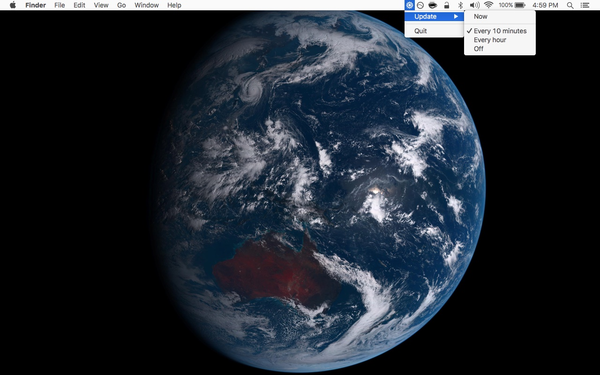

<h1 align="center">
  <br>
  
  <br>
  hi8
  <br>
  <br>
</h1>

<h4 align="center">See Earth from Himawari-8 on your desktop every 10 minutes.</h4>

<p align="center">
  <a href="https://www.npmjs.com/package/hi8"></a>
  <a href="https://travis-ci.org/ungoldman/hi8"></a>
  <a href="http://npm.im/standard"></a>
</p>

## About

**"Himawari" (ひまわり) is Japanese for "sunflower".** :sunflower:

[Himawari 8](http://himawari8.nict.go.jp/) is a [geostationary](https://en.wikipedia.org/wiki/Geostationary_orbit) weather satellite deployed by the [Japan Meteorological Agency](http://www.jma.go.jp/jma/indexe.html). It takes photographs of Earth every 10 minutes.

**hi8** is a macOS menubar app that automatically sets the latest image from the Himawari 8 geostationary satellite as your desktop background every 10 minutes.




This project is alpha quality, please [report any bugs](../../issues)! (:grin: and maybe fix them! :grin:)

## Install

For now, you can install `hi8` via [`npm`](npmjs.com).

```
npm install -g hi8
```

In *the future*, `hi8` will be packaged as an app and downloadable via the [releases](../../releases) page.

**Warning: requires :zap: magick :zap:**

* [imagemagick](http://www.imagemagick.org/script/index.php)
* [graphicsmagick](http://www.graphicsmagick.org)

If you have [homebrew](http://brew.sh/) installed, you can `brew install imagemagick graphicsmagick`.

If you know of a better (dependency-free) way to process the images (or package `imagemagick` and `graphicsmagick` with the application), please [let me know](../../issues/new)!

## Usage

```
hi8
```

## Contributing

Contributions welcome! Please read the [contributing guidelines](contributing.md) first.

## Change Log

This project has a [change log](changelog.md)!

## Credit

Sunflower icon created by [Federico Panzano](https://thenounproject.com/panzano/) from [Noun Project](https://thenounproject.com/term/sunflower/120542/). Used under the [CC BY 3.0 US](https://creativecommons.org/licenses/by/3.0/us/) license.

## Resources

Here are some useful links if you're interested in learning more about the Himawari 8 satellite.

### Official

- [Himawari 8 Real-time Web](http://himawari8.nict.go.jp)
- [Himawari Data Guide](http://www.eorc.jaxa.jp/ptree/userguide.html)
- [Himawari 8/9 Standard Data User's Guide](http://www.data.jma.go.jp/mscweb/en/himawari89/space_segment/hsd_sample/HS_D_users_guide_en_v12.pdf)
- [JAXA account registration (for access to more data)](http://www.eorc.jaxa.jp/ptree/registration_top.html)

### Related Projects

- [Glittering Blue](http://glittering.blue)
- [celoyd/hi8](https://github.com/celoyd/hi8)
- [Himawari 8 animation tutorial](https://gist.github.com/celoyd/b92d0de6fae1f18791ef)
- [deband python script](https://gist.github.com/celoyd/a4dd9202fe5c7978b114)
- [makeaday bash script](https://gist.github.com/celoyd/c2293929ab3fe97ea597)
- [himawari.js](https://github.com/jakiestfu/himawari.js)
- [himawari-bg](https://github.com/ungoldman/himawari-bg)
- [himawari-urls](https://github.com/ungoldman/himawari-urls)
- [himawari-history](https://github.com/ungoldman/himawari-history)

## License

[ISC](license.md)
