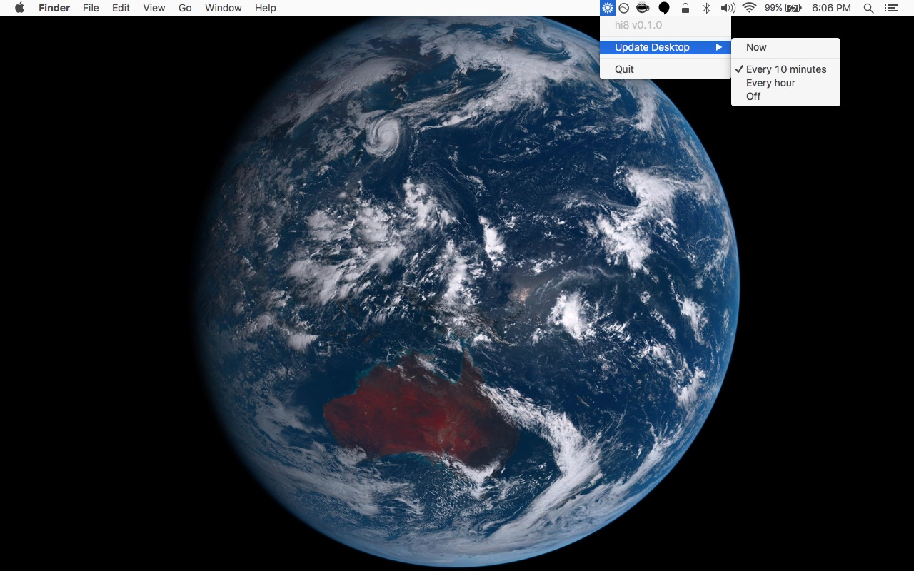
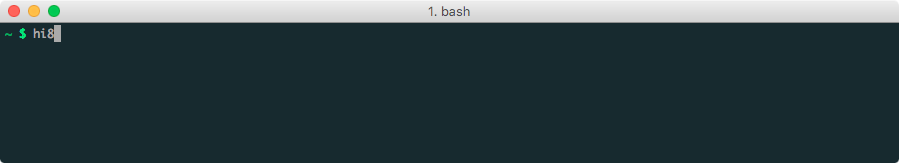
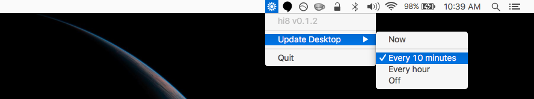

<h1 align="center">
  
  <br>
  hi8
  <br>
</h1>

<h5 align="center">See Earth from Himawari-8 on your desktop every 10 minutes.</h5>

<p align="center">
  <a href="https://nodejs.org/api/documentation.html#documentation_stability_index">
    
  </a>
  <a href="https://www.npmjs.com/package/hi8">
    
  </a>
  <a href="https://travis-ci.org/ungoldman/hi8">
    
  </a>
  <a href="http://npm.im/standard">
    
  </a>
</p>

## About

**"Himawari" (ひまわり) is Japanese for "sunflower".** :sunflower:

**[Himawari 8](http://himawari8.nict.go.jp/)** is a [geostationary](https://en.wikipedia.org/wiki/Geostationary_orbit) weather satellite deployed by the [Japan Meteorological Agency](http://www.jma.go.jp/jma/indexe.html). It takes photographs of Earth every 10 minutes.

**hi8** is a macOS menubar app that sets the latest image from Himawari-8 as your desktop background every 10 minutes.



This project is alpha quality, please [report any bugs](https://github.com/ungoldman/hi8/issues)! <small>and maybe fix them! :grin:</small>

## Install

In *the future*, **hi8** will be packaged as an app and downloadable via the [releases](https://github.com/ungoldman/hi8/releases) page.

For now, you can install **hi8** via [`npm`](npmjs.com).

```
npm install -g hi8
```

### Requirements

- [**:zap: GraphicsMagick :zap:**](http://www.graphicsmagick.org)

GraphicsMagick is an image processing library that helps stitch together the satellite images to produce a full picture of Earth.

The high resolution satellite images from Himawari-8 come in fragments like [this one](http://himawari8-dl.nict.go.jp/himawari8/img/D531106/4d/550/2016/10/05/193000_2_0.png). At the resolution **hi8** uses, there are sixteen images that need to be stitched together to create a full picture of Earth.

If you have [homebrew](http://brew.sh/), you can just `brew install graphicsmagick`.

If you know of a better (dependency-free) way to process the images (or package `imagemagick` and `graphicsmagick` with the application), please [let me know](https://github.com/ungoldman/hi8/issues/3)!

## Usage

Once **hi8** and [GraphicsMagick](http://www.graphicsmagick.org) have been installed, all you need to do is run the `hi8` command from a terminal.



**hi8** will start in the background and from there it can be managed from the menubar.



## Contributing

Contributions welcome! Please read the [contributing guidelines](contributing.md) first.

## Change Log

This project has a [change log](changelog.md)!

## Credit

Sunflower icon created by [Federico Panzano](https://thenounproject.com/panzano/) from [Noun Project](https://thenounproject.com/term/sunflower/120542/). Used under the [CC BY 3.0 US](https://creativecommons.org/licenses/by/3.0/us/) license.

## Resources

Here are some useful links if you're interested in learning more about the Himawari-8 satellite.

### Official

- [Himawari-8 Real-time Web](http://himawari8.nict.go.jp)
- [Himawari Data Guide](http://www.eorc.jaxa.jp/ptree/userguide.html)
- [Himawari-8/9 Standard Data User's Guide](http://www.data.jma.go.jp/mscweb/en/himawari89/space_segment/hsd_sample/HS_D_users_guide_en_v12.pdf)
- [JAXA account registration (for access to more data)](http://www.eorc.jaxa.jp/ptree/registration_top.html)

### Related Projects

#### Sites

- [Glittering Blue](http://glittering.blue): A hi-res video of one day's rotation of Earth viewed from Himawari-8.
- [celoyd/hi8](https://github.com/celoyd/hi8): Tools for making animations from Himawari-8 P-Tree data.
- [himawari-8-chrome](https://github.com/domoritz/): Himawari 8 New Tab Page (Chrome Extension).
- [himawari.js](https://github.com/jakiestfu/himawari.js): Download real-time images of Earth from the Himawari-8 satellite.
- [himawari-bg](https://github.com/ungoldman/himawari-bg): Set the latest image from Himawari 8 as your desktop background.
- [himawari-urls](https://github.com/ungoldman/himawari-urls): Get URLs for Himawari 8 image tiles based on a given date.
- [himawari-history](https://github.com/ungoldman/himawari-history): Download all Himawari 8 images in a date range.
- [Himawari-8 animation tutorial](https://gist.github.com/celoyd/b92d0de6fae1f18791ef): A way to make Himawari-8 animations.
- [hi8-deband.py](https://gist.github.com/celoyd/a4dd9202fe5c7978b114): Python script for correcting noise along scanlines for Himawari-8 images.
- [makeday.sh](https://gist.github.com/celoyd/c2293929ab3fe97ea597): Bash script for downloading and processing a day's worth of Himawari-8 images.

## License

[ISC](license.md)
